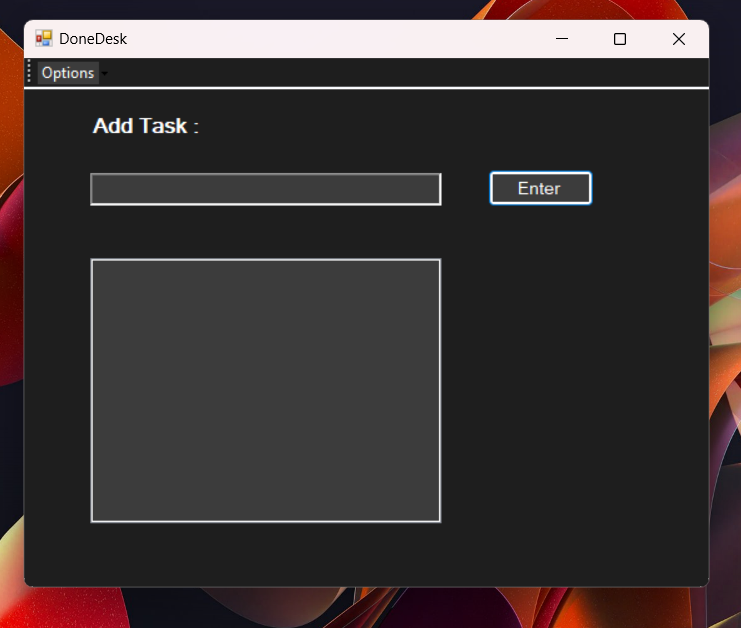
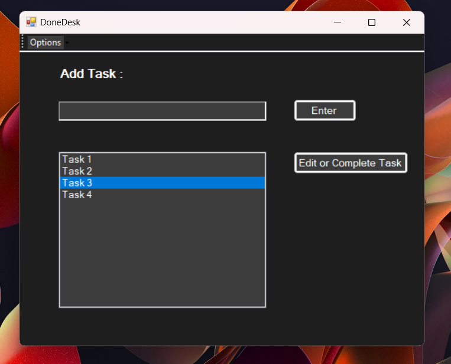
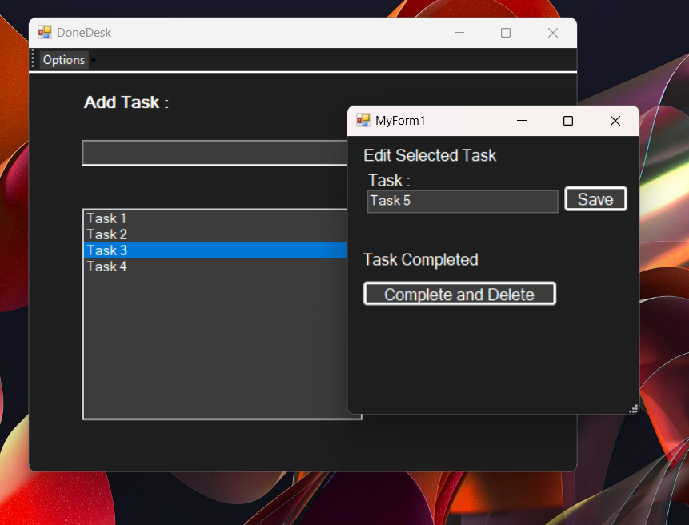
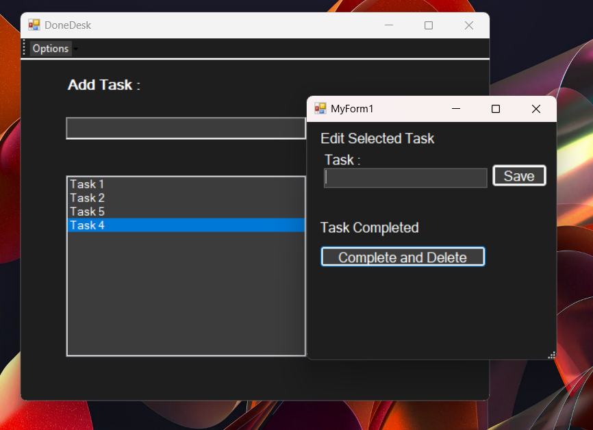
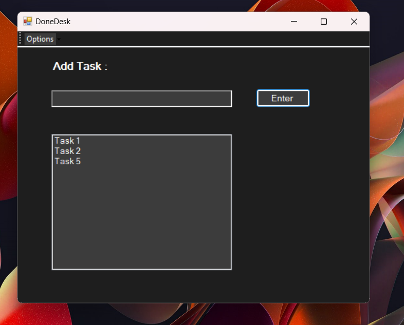

# DoneDesk

**DoneDesk** is a simple yet powerful to-do list application designed to help you manage your tasks efficiently. Built using C++/CLI with Windows Forms, DoneDesk offers an intuitive interface for task management and organization.

## Features

- **Task Management**: Add, edit, and remove tasks easily.
- **Task Prioritization**: Assign priorities to tasks for better organization.
- **Search Functionality**: Quickly find tasks using the search feature.
- **Customizable Interface**: Adjust font styles and sizes to suit your preferences.
- **Rich Text Support**: Use rich text formatting in task descriptions.

## Installation

1. **Clone the Repository**

   ```bash
    git clone https://github.com/yourusername/DoneDesk.git
   ```

 2. **Open the Project**

    - Open the `DoneDesk.sln` file in Visual Studio.
 3. **Build the Project**

    - Set the configuration to `Release` mode.
    - Build the solution to generate the executable.

 4. **Run the Application**

    - Navigate to the output directory (usually `bin\Release`).
    - Run `DoneDesk.exe`.

 ## Usage

 - **Add Task**: Click on the "Add" button to create a new task.
 - **Edit Task**: Select a task and click "Edit" to modify its details.
 - **Remove Task**: Select a task and click "Remove" to delete it.
 - **Search Tasks**: Use the search bar to find tasks quickly.

 ##Some Screenshots

1. **Main Form of the Application**

 

2. **Add New Tasks**

 

3. **Click Edit And Complete Task**

 

4. **Edit the selected Task**

 

5. **You can also Complete the Task(Note : This Operation Deletes the Task)**

 
 
 6. **Huray! You've Completed the Task**

 
 ## Contributing

 1. **Fork the Repository**

    - Click on the "Fork" button at the top right of this page.

 2. **Create a New Branch**

    ```bash
    git checkout -b feature/your-feature
    ```

 3. **Make Your Changes**

    - Implement your feature or fix the bug.

 4. **Commit Your Changes**

    ```bash
    git add .
    git commit -m "Add your message here"
    ```

 5. **Push to the Branch**

    ```bash
    git push origin feature/your-feature
    ```

 6. **Create a Pull Request**

    - Go to the repository on GitHub and click "New Pull Request".
